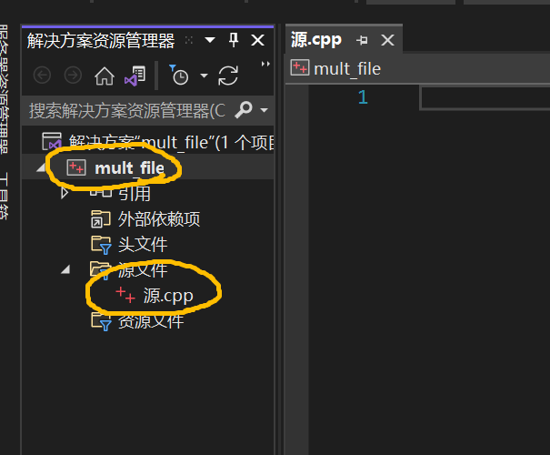

# 第一讲：多文件组织

​		**什么是项目？什么是文件？**这些问题的答案或许没有出现在程设的课堂上，但我们其实一直在和它们打交道：使用Visual Studio完成作业的同学都知道，打开Visual Studio后会首先进入“创建新项目”的界面，选择“空项目”之后便会来到我们熟悉的操作界面，然后点击源文件→添加→新建项，最后创建“源.cpp”就可以愉快coding了。

<div align="center">    

</div>
​		**通过以上这波操作，我们其实已经创建了项目和文件。**如上图所示，我创建了名为“mult_file”的项目，又在该项目下创建了一个名为“源.cpp”的文件。通俗来讲，文件就是某一形式的代码信息的集合，其命名会以.cpp、.h等结尾，为了实现某一功能而将文件组合起来，便形成项目，一个项目中往往包含多个文件。为了进一步了解使用多文件的原因以及多文件组织的规范，我们有必要先了解一下代码变成可以被计算机执行的程序之前，都经历了什么。


## 1.预处理、编译、汇编和链接

​		c++代码会放在源文件（命名后缀.cpp）或头文件（命名后缀.h）中，它们经编译器处理后生成可执行文件（命名后缀.exe），整个过程包括**预处理、编译、汇编、链接**四个步骤。负责进行这些操作的程序被分别称作**预处理器、编译器、汇编器、链接器**，再次我们把它们四个的集合成为**编辑器**。


### 1.1预处理(Preprocessing)

​		预处理操作是针对预处理指令的操作。所谓**预处理指令**是指以“#”开头的指令，包括`#include`、宏定义命令`#define`等。在进行预处理时，会将预处理指令对应的内容插到源程序中，例如将`#include`指定的内容插入程序中、将程序中使用的宏定义进行替换。

​		预处理会将.cpp、.h文件转换成.i文件，由于插入了预处理指令对应的内容，.i文件相比对应的.cpp文件会大很多。.i文件仍旧是文本文件，可以通过文本编辑器打开。

​		将try1.cpp进行预处理得到try1.i的命令为：`g++ -E try1.c -o try1.i`

> 此命令是GCC编译器的命令，对于Windows安装MinGW后即可在命令行中使用。Mac OS内置clang编辑器，基本语法命令与GCC编译器类似，可参考[clang常用语法介绍 - 简书 (jianshu.com)](https://www.jianshu.com/p/96058bf1ecc2)或直接百度。


### 1.2编译(Compilation)

​		编译是指将经过预处理得到的文件转换成特定汇编代码的过程，编译后会生成对应的.s文件，这个文件不会像.o文件那么臃肿，也是文本文件，可以通过文本编辑器查看。

​		将try1.i进行编译得到try1.s的命令为：`g++ -S try1.i -o try1.s`


### 1.3汇编(Assemble) 

​		汇编步骤会把编译得到的汇编代码转换成机器码，产生.o\\.obj文件，该文件是二进制格式。

​		将try1.s进行汇编得到try1.o的命令为：`g++ -c try1.s -o try1.o`


### 1.4链接(Linking)

​		汇编得到的二进制文件并不是操作系统可以使用的可执行文件，还需要通过链接来将.o文件转换成.exe\\.out文件。链接可以视作整个过程最终的组合环节，项目中的若干.h、.cpp文件经过一步步处理产生.o文件后，链接步骤将这些.o文件组合起来，生成一个可执行文件。

​		在前3个步骤中编辑器都只会**查看一个文件**，而在链接时编辑器会同时**查看多个文件**。在编译时，如果编辑器找不到特定函数的定义，编辑器会假定该函数已经在另一个文件中被定义而不会报错；而在链接时，编辑器会查找未提及的函数的引用并报错。通常情况下，编译错误是由语法导致，如符号中英文出错，将main写成mian；而链接错误与缺少定义或存在多个定义有关。

​		将try1.o进行链接得到try1.exe的命令为：`g++ try1.o -o try1.exe`


​		4个步骤的先后顺序和涉及的文件如下图：

<div align="center">    

</div>


## 2.使用多文件的原因

​		站在**代码读者**的角度，一个项目使用多个文件就像一本书分成多个章节一样。一般的c++项目动辄上万行代码，如果把它们全部放在一个文件中，即使注释再好也不便于读者阅读；而且往往读者只会关注项目中涉及某个特定功能的代码，在庞大的单个文件中查找费时费力。所以一个项目会把实现某一功能的代码放在一个文件中，这样仅通过文件的命名就可以快速找到目标代码，预览整个项目时也会有主有次。

​		站在**代码作者**的角度，一个项目使用多个文件有助于编程**模块化**，例如有些代码负责运行逻辑，有些代码负责函数实现，将这些代码放在不同的文件中，分批次进行模块化编写，可以让整个编写过程更有逻辑。同时一个项目使用多个文件有助于代码的**修改和维护**，在修改和维护代码时只需要改动定义和声明部分，其余代码无需修改即可正常工作，这样修改代码后无需对整个项目重新进行预处理、编译、汇编和链接，而只需要对修改过的文件进行这些操作即可。


## 3.多文件组织规范

​		与单一文件相比，多文件组织的区别在于引入了多个源文件，以及引入了头文件。多个源文件意味着多文件组织必须处理文件之间的共用的变量\函数\类，这就涉及声明和定义的问题。引入头文件意味着我们必须进一步了解头文件的作用和编写规范。


### 3.1声明（Declaration）和定义（Definition）

​		**声明**是给出变量、函数或类的名字（而不指明其内容），而**定义**是具体说明一个变量、函数或类的内容。声明变量的语法是“extern+变量类型+变量名”，例如`extern int a`，其余的声明和定义的语法都会在程设课程中提及。

​		多文件中声明和定义的规范只有一条，就是**函数\变量\类只能定义一次，但可以声明许多次**。例如可以在一个源文件try.cpp中定义变量`int num = 30;`，然后在源文件try1.cpp中声明此变量`extern int num;`，在源文件try2.cpp中声明此变量`extern int num;`，这样便可以在源文件try1.cpp和try2.cpp中使用源文件try.cpp中的int型变量num。也正是由于声明仅是给出变量的名字而非变量的内容，所以代码`extern int num = 20;`是非法的。


### 3.2头文件

​		**头文件**是后缀为.h\\.hpp的文件，和源文件.cpp一样是多文件组织中极其重要的文件类型，头文件的**主要用途**是将声明传播到源文件中。头文件允许我们将声明放在一个位置，然后将其导入到任何需要的位置。这可以节省多文件程序中的大量键入。

​		可以通过下面这个简单程序来理解头文件的作用：

```c++
#include<iostream>
int main()
{
    cout<<"Hello World!"<<endl;
}
```

在该程序中，我们并没有给出`cout`和`<<`的声明或定义，但是该程序依旧可以正常运行，原因就在于我们通过`#include<iostream>`引入了头文件“iostream”，`cout`和`<<`已经在该头文件中声明。

> iostream和iostream.h是不同的头文件，这两个文件的产生有一定的历史原因，在此不详细说明。


​		关于头文件的一些具体规范如下：

#### 3.2.1变量和函数尽量不要在头文件中定义

​		在预处理时，预处理器会将头文件中的内容导入源文件中，由于在源文件中往往会包含变量和函数的定义，因此如果头文件中也含有变量和函数的定义，那么预处理后的代码中会出现对同一变量\函数的多次定义，进而会在编译时导致**重定义**的错误。因而头文件通常不应包含函数和变量定义。


#### 3.2.2类可以在头文件中定义

​		一个类往往附带若干成员函数，如下面代码所示，c++允许在类的定义之外定义类的成员函数，这样可以避免类的定义过分臃肿，也方便代码的管理。

```c++
class Coder {
 public:
  Coder(int, double);
  int Get_num();
  double Get_month_salary();

 private:
  int num_;
  double month_salary_;
};


Coder::Coder(int wnum, double wsa) {
  num_ = wnum;
  month_salary_ = wsa;
}

int Coder::Get_num() {
  return num_;
}

double Coder::Get_month_salary() {
  return month_salary_;
}
```

​		这种编写方式逐渐成为规范，如此一来，类的定义无论从形式还是作用上看都越来越类似于声明，允许类在头文件中定义也因此顺理成章。当然这样做大大增加了重定义的风险，这个问题可以通过下面的头文件保护机制来解决。


#### 3.2.3头文件保护

​		在实际的代码编写中，由于编写者的疏忽等原因，往往会由于头文件而产生的重定义的错误；在某些情况下，我们必须把类的定义放在头文件中，这就进一步增加了重定义的可能。可以引入头文件保护机制来处理这一问题。所谓**头文件保护机制**，就是按照如下的格式来编写头文件：

```c++
#ifndef XX 
#define XX 

//body
 
#endif
```

​		其中`//body`就是原来的头文件的内容，`XX`按照惯例是头文件的全名（全部字母大写，标点符号用`_`代替），如对于try.h文件，它对应的`XX`就是TRY_H。

​		在预处理后，如果同一个头文件出现了两次，则第二次出现时`XX`已经被`#define XX `代码定义，所以第二次出现时`#ifndef XX `不再满足，这就保证了相同的内容不会重复出现两次，进而降低了重定义发生的可能性。

​		`#pragma once`指令也可以起到相同的作用，它的使用方法更加简单，在头文件最开始的地方加上`#pragma once`即可。


#### 3.2.4将头文件导入源文件的方法

 - `#include<>`：常用来导入系统文件

 - `#include""`：先找与编译文件同文件夹下的头文件，再像`#include<>`一样找系统文件

> 值得注意的是，头文件不仅可以导入源文件中，也可以导入头文件中，即在头文件中引入头文件也是合法的（在许多情况下甚至是必要的），将头文件导入头文件的方法与将头文件导入源文件的方法一致。

​		

​		此外，关于头文件还有一些细节知识\规范\建议：

1. 头文件的名称应尽量与相对应的源文件的名称相同，例如：grades.h 与 grades.cpp。
2. 各个”头文件——源文件“组合应尽可能彼此独立。
3. “#include”之后不能跟.cpp文件


------

​		为了使大家对多文件机制能够有更深刻的理解，我编写了一份实例代码放在`codes/`文件夹内，大家可以自行阅读和运行尝试。祝大家学习愉快！

> 将`codes/`文件夹内的文件进行编译生成名为main的可执行文件的命令是：
>
> `g++ -o main occupation.h occupation.cpp salary.h salary.cpp main.cpp`

