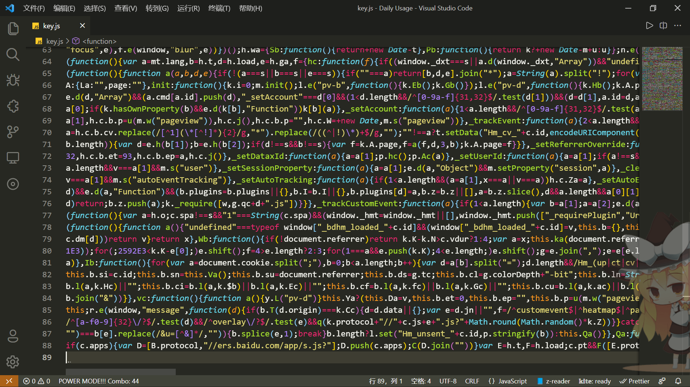

# 第一讲：Google Coding Style

## 关于代码风格

### 什么是代码风格？

​		代码风格`Coding Style`，最早是《The C Programming Language》一书的作者`Kernighan`与`Ritchie`提出的。他们在处理 C 语言的书写时，采用了一些特定的格式，后称为`K&R`风格。

​		正如这个词语本身所指的，一个编程风格更偏向于主观的习惯和规范，而并不是一份代码能不能顺利运行的强制性的条件和准则。即便你编写的是形似下图所示的代码，计算机也绝不会和助教一样对此产生任何的意见并认为它是完全没有任何问题的（doge）。

​		“什么是代码风格？”——“如图所示。”

<div align="center">
    
</div>

### 为什么我们需要一个统一的、优秀的代码风格？

​		假设我们写的是文章而不是程序，那么你一定觉得诸如文章应该分为若干个自然段、每段开头空两格之类的规则是理所当然的。如果段落的开头不空两格，或者干脆把整个文章写成单独的一段，仔细想来<u>似乎也不会影响文章实质内容的表达</u>。

​		既然如此，我们为什么还要在形式上下功夫呢？显然，代码风格不是为强迫症 Coder 专门设计的规范，而应该是为<u>每一个</u>代码编写者所提供的参考。

​		这是一个很简单的道理：设想一下，如果你手中的这本书既无章节也无目录，正文中的不同内容都使用同样的字体字号印刷，几百页纸从头至尾洋洋洒洒如念经般地“一气呵成”（**恰似开头我们所展示的图片**），你还有耐心看下去吗？

​		很多同学，包括笔者本人，有时候想去翻看之前一段时间写过的代码，但是发现已经不知道当时的思路，必须静下心来一行一行地读自己天书般的代码，有时候甚至<u>完全不知道自己在写些什么</u>……

​		所以说，即便是我们一个人写的一份简短的代码，在一段时间后都不能很迅速的复盘出这份代码的功能，如果这件事发生在一个很大的、由几百上千人共同完成的工程系统，每个程序员不但要花时间看明白其他人的代码，还要花时间看懂自己昨天晚上写的代码，那岂不是过于糟糕？

​		在这样的情况之下，<u>一个统一的、良好的代码风格就显得十分的重要且必要了</u>。对于程序设计的初学者来说，能够养成一个好的代码书写习惯是非常有益处的。

​		在本节接下来的教程中，笔者就将为大家分享 Google 开源项目的一些相对基础和常见的 C++ 编程风格。

---

## Google Coding Style 初步

### 1. 基本格式

- 每一行的**代码**长度不要超过 80 个字符
  - 如果无法在不伤害易读性的情况下进行断行，那么**注释行**<u>可以超过</u> 80 个字符
  - 例如，带有**命令示例**或者**网址链接**的行<u>允许</u>超过 80 个字符
  - 包含**长路径**的`#include`语句可以超过 80 个字符
- 在代码书写时使用**空格键**进行缩进，不要使用`Tab`键


### 2. 程序格式

#### 2.1 函数

- **函数的声明与定义**

1. 一个普通的函数声明应当写成以下形式：

   ```c++
   ReturnType ClassName::FunctionName(Type par_name1, Type par_name2) {
     DoSomething();	// 2 space indent before "DoSomething"
     ...
   }
   ```

   在`Google Coding Style`中，推荐函数的**左括号与函数名同行**；

   括号内的函数体代码前的间距是 **2 个空格(space)**；

   很多同学是用 1 个 Tab 键，可能是 4 个空格，这样的形式是**不标准**的。

   

2. 如果函数的参数较多，一行不能放下所有的参数：

   ```c++
   ReturnType ClassName::ReallyLongFunctionName(Type par_name1, Type par_name2,
                                                Type par_name3) {
     DoSomething();
     ...
   }
   ```

   当参数换行时，下一行的参数要和上一行的参数之间对齐；

   关于括号和函数体代码的缩进与第 1 点所陈述的内容一致。
   
   


3. 如果参数实在太长，第一个参数都放不下：

   ```c++
   ReturnType LongClassName::ReallyReallyReallyLongFunctionName(
       Type par_name1,  // 4 space indent
       Type par_name2,
       Type par_name3) {
     DoSomething();  // 2 space indent
     ...
   }
   ```

   如果第一个参数都换行处理，那么每个参数前需要空出 **4 个空格(space)**。


4. 一些总结
   1. 如果返回类型和函数名在同一行放不下，分行；
   2. 如果返回类型和函数的声明或定义分行了，**不要缩进**；
   3. 左圆括号总是和函数名在同一行，它们之间**永远没有空格**；
   4. **圆括号与参数之间无空格**；
   5. 左大括号总在最后一个参数的同一行的末尾，**不另起新行**；
   6. 右大括号总**单独位于函数的最后一行**（当函数为空时，与左大括号同行）；
   7. 右圆括号与左大括号之间有 **1 个空格**；
   8. 换行后的参数有 **4 个空格**的缩进。


- **函数的调用**

1. 总述（函数调用的**三种情况**，分别与函数声明的 1、2、3 点依次类似对应）
   1. 一行写完函数调用
   2. 在圆括号内对参数分行对齐
   3. 参数另起一行，保持 4 个空格的缩进


2. 以上总述的代码示例

   1. 基础的函数调用遵循如下形式：

      ```c++
      bool retval = DoSomething(argument1, argument2, argument3);
      ```

   

   2. 如果同一行放不下，可以在圆括号内对参数分行：

      ```c++
      bool retval = DoSomething(averyveryveryverylongargument1,
                                argument2, argument3);
      ```

      后面的每一个参数都与第一个参数对齐，左圆括号和右圆括号前**不留空格**。
      

   3. 参数也可以直接放在次行，保持 4 个空格的缩进：

      ```c++
      DoSomething(
          argument1, argument2,  // 4 space indent
          argument3, argument4);
      ```


- 函数的返回值

  - 不要在`return`表达式中添加**不必要的括号**；

  - 在特定情况下，可以通过添加括号改善可读性：

    ```c++
    // 可以用圆括号把复杂表达式圈起来, 改善可读性.
    return (some_long_condition &&
            another_condition);
    ```

    

#### 2.2 条件语句

- 基本说明
  - 对基本条件语句，有两种可以接受的条件格式；
  - 一种格式是在圆括号和条件之间有空格，另一种是在圆括号和条件之间无空格；
  - 我们推荐**不加空格**的书写风格。


- 示例代码

  - ```c++
    if (condition) {   
      ...
    } else if (...) {
      ...
    } else {
      ...
    }
    ```

  - `if`和左圆括号之间一定要有 **1 个空格**；

  - 右圆括号和左大括号**保持同行**，并且相距 **1 个空格**；

  - `else`和右大括号之间要有 **1 个空格**；

  - **大括号内的代码**仍然保持 **2 个空格**的缩进。


- 其他情形

  - 如果能够增强可读性，简短的语句可以写在同一行：

    ```c++
    if (x == kFoo) return new Foo();
    if (x == kBar) return new Bar();
    ```

    **该情况仅仅适用于语句简单且不含`else`子句的时候**。

  

  - 通常，单行语句可以省略大括号：

    ```c++
    if (condition)
      ...
    ```

    但是值得注意的是，如果某一个`if-else`语句使用了大括号，则其他分支**也必须使用**。


#### 2.3 循环与开关选择语句

- 基本说明
  - `switch`语句**可以使用**大括号分段（**也可以不用**），来表明`case`之间不是连在一起的；
  - 在单语句循环中，括号可以省略；
  - 空的循环体应当使用`{}`或者`continue`。


- 示例代码

  - ```c++
    switch (var) {
      case 0: {  // 2 空格缩进
        ...      // 4 空格缩进
        break;
      }
      case 1: {
        ...
        break;
      }
      default: {
        assert(false);
      }
    }
    ```

  - 如果你习惯于把每一个`case`用大括号分段，可参考上述代码的格式；

  - 条件语句与括号之间**没有空格**，括号前后均有 **1 个空格**，这一点与条件语句的规范是**类似**的；

  - 每一个`case`前有 **2 个空格**的缩进；大括号内的代码块有 **4 个空格**的缩进；

  - `switch`总应当包含一个`default`模块，
    这样当条件语句取到我们所不希望的值时，我们能够通过错误信息的提示迅速找到它。


#### 2.4 指针和引用表达式

- 基本说明
  - 句点`.`或者箭头`->`**<u>前后</u>  不要有空格**；
  - 指针`*`或者地址操作符`&`**<u>之后</u> 不要有空格**；


- 示例代码

  - 下面是指针和引用表达式的正确使用范例：

    ```c++
    x = *p;
    p = &x;
    x = r.y;
    x = r->y;
    ```

  - 在声明指针变量或参数时，星号`*`与**类型**或**变量名**紧挨**都是可以接受的**：

    ```c++
    // 好的写法, 空格前置.
    char *c;
    const string &str;
    
    // 好的写法, 空格后置.
    char* c;
    const string& str;
    ```

    值得注意的是，单个文件的写法**应当保持一致**。


#### 2.5 列表初始化、变量与数组初始化

- 基本说明【什么是列表初始化？】

  - 在 `C++ 11`中，**任何对象类型**都可以被列表初始化。范例代码如下：

    ```c++
    // Vector 接收了一个初始化列表，以下两种写法等价。
    vector<string> v{"foo", "bar"};
    vector<string> v = {"foo", "bar"};
    
    // 可以配合 new 一起用，这里的 auto 为自动类型推断关键字。
    auto p = new vector<string>{"foo", "bar"};
    
    // map 接收了一些 pair, 列表初始化大显神威。
    // map 相当于建立一种 key-value 的数据结构，类似 Python 中的字典。
    map<int, string> m = {{1, "one"}, {2, "2"}};
    
    // 初始化列表也可以用在返回类型上的隐式转换。
    vector<int> test_function() { return {1, 2, 3}; }
    
    // 初始化列表可迭代。
    for (int i : {-1, -2, -3}) {}
    
    // 在函数调用里用列表初始化。
    void TestFunction2(vector<int> v) {}
    TestFunction2({1, 2, 3});
    ```

  - 关于列表初始化的详细内容，参见[列表初始化]([6. 其他 C++ 特性 — Google 开源项目风格指南 (zh-google-styleguide.readthedocs.io)](https://zh-google-styleguide.readthedocs.io/en/latest/google-cpp-styleguide/others/#braced-initializer-list)) 

- 示例代码

  - 列表初始化的格式要求与函数调用的格式要求是**极为类似**的：

    ```c++
    // 一行列表初始化示范.
    return {foo, bar};
    functioncall({foo, bar});
    pair<int, int> p{foo, bar};
    ```

  - 以下是变量和数组初始化的例子：

    ```c++
    // 下面是两组等价的初始化描述，第一组定义了一个 int 类型的变量 x，取值为 3
    // 第二组定义了一个 string 类型的变量 name，取值为 Some Name
    int x = 3;
    int x(3);
    int x{3};
    string name("Some Name");
    string name = "Some Name";
    string name{"Some Name"};
    ```

  - 在使用列表初始化定义某些变量时，**注意`{}`和`()`的区别**：

    ```c++
    vector<int> v(100, 1);  // 内容为 100 个 1 的向量.
    vector<int> v{100, 1};  // 内容为 100 和 1 的向量.
    
    // 列表初始化形式不允许整型数据的四舍五入，以避免不必要的编程失误.
    int pi(3.14);  // 编译通过：pi == 3.
    int pi{3.14};  // 编译错误：缩窄转换.
    ```

    

#### 2.6 预处理指令

- 基本说明

  - 预处理指令**不要缩进**，从行首开始；
  - 即使预处理指令位于代码块中间，**仍然不要缩进**。

- 示例代码

  - ```c++
    if (lopsided_score) {
    #if DISASTER_PENDING      // 正确 - 从行首开始
        DropEverything();
    # if NOTIFY               // 非必要 - # 后跟空格
        NotifyClient();
    # endif
    #endif
        BackToNormal();
    }
    ```

  - 预处理指令在`#`后**无需加上空格**，且**一定需要**从行首开始书写。


#### 2.7 类格式

- 基本说明

  - 访问控制块的声明**顺序**依次是`public:` `protected:` `private:`，每个控制符缩进 **1 个空格**。

- 示例代码

  - ```c++
    class MyClass : public OtherClass {
     public:      						// 注意有一个空格的缩进
      MyClass();  						// 标准的两空格缩进
      explicit MyClass(int var);
      ~MyClass() {}
    
      void SomeFunction();
      void SomeFunctionThatDoesNothing() {
      }
    
      void set_some_var(int var) { some_var_ = var; }
      int some_var() const { return some_var_; }
    
     private:							// 注意第二个控制符 private: 前空了一行
      bool SomeInternalFunction();
    
      int some_var_;
      int some_other_var_;
    };
    ```

  - 所有**基类名称**在满足 80 列限制下应与子类名放在**同一行**；
  - 除了首个访问控制符（一般是`public:`）之外，其余的控制符前需要**空出一行**。


#### 2.8 构造函数初始值列表

- 基本说明

  - 构造函数初始化列表**放在同一行**或按**四格缩进**并排多行。

- 示例代码

  - 如果所有的变量都可以放在同一行：

    ```c++
    MyClass::MyClass(int var) : some_var_(var) {
      DoSomething();
    }
    ```

    注意**冒号前后**有 **1 个空格**，且列表末尾和左大括号之间有 **1 个空格**。

    

  - 如果不能放在同一行，那么必须置于**冒号之后**，缩进 **4 个空格**：

    ```c++
    MyClass::MyClass(int var)
        : some_var_(var), some_other_var_(var + 1) {
      DoSomething();
    }
    ```

    

  - 如果初始化列表需要置于多行，则需要将每一个成员**放在单独一行**，且**逐行对齐**：

    ```c++
    MyClass::MyClass(int var)
        : some_var_(var),             // 4 space indent
          some_other_var_(var + 1) {  // lined up
      DoSomething();
    }
    ```

  

  - 当函数体为空时，左右大括号可以放在一起：

    ```c++
    MyClass::MyClass(int var)
        : some_var_(var) {}
    ```

    

#### 2.9 留白

- **水平留白**

  - 基本说明：水平留白的使用根据代码的**位置决定**，不要在**行尾**添加无意义的留白。

  - 示例代码：

    - 基本使用部分：

      ```c++
      void f(bool b) {  // 左大括号前总是有空格.
        ...
      }
      
      int i = 0;  // 分号前不加空格.
      
      // 列表初始化中大括号内的空格是可选的.
      // 如果加了空格, 那么两边都要加上.
      int x[] = { 0 };
      int x[] = {0};
      
      // 继承与初始化列表中的冒号前后恒有空格.
      class Foo : public Bar {
       public:
        // 对于单行函数的实现, 在大括号内加上空格
        // 然后是函数实现
        Foo(int b) : Bar(), baz_(b) {}  // 大括号里面是空的话, 不加空格.
        void Reset() { baz_ = 0; }  // 用空格把大括号与实现分开.
        ...
      }
      ```

    - 循环与条件语句：

      ```c++
      if (b) {          // if 条件语句和循环语句关键字后均有空格.
        ...
      } else {          // else 前后有空格.
        ...
      }
      
      while (test) {}   // 圆括号内部不紧邻空格.
      
      switch (i) {
      for (int i = 0; i < 5; ++i) {
          
      switch ( i ) {    // 循环和条件语句的圆括号里可以与空格紧邻.
      if ( test ) {     // 圆括号, 但这很少见. 总之要一致.
      
      for ( int i = 0; i < 5; ++i ) {
      for ( ; i < 5 ; ++i) {  // 循环里内 ; 后恒有空格, ;  前可以加个空格.
      
      switch (i) {
        case 1:         // switch case 的冒号前无空格.
          ...
        case 2: break;  // 如果冒号有代码, 加个空格.
      ```

    - 操作符

      ```c++
      // 赋值运算符前后总是有空格.
      x = 0;
      
      // 其它二元操作符也前后恒有空格, 不过对于表达式的子式可以不加空格.
      // 圆括号内部没有紧邻空格.
      v = w * x + y / z;
      v = w*x + y/z;
      v = w * (x + z);
      
      // 在参数和一元操作符之间不加空格.
      x = -5;
      ++x;
      if (x && !y)
        ...
      ```

    - 模板和转换

      ```c++
      // 尖括号(< and >) 不与空格紧邻, < 前没有空格, > 和 ( 之间也没有.
      vector<string> x;
      y = static_cast<char*>(x);
      
      // 在类型与指针操作符之间留空格也可以, 但要保持一致.
      vector<char *> x;
      ```

      

- **垂直留白**

  - **垂直留白越少越好**。
  - “**这不仅仅是规则，而是原则问题了。**”我们应该**尽可能少地使用空行**；
  - 两个函数之间的空行**不要超过 2 行**，函数体首尾不要留空行，函数体中也不要随意加空行；
  - 在多重`if-else`代码块中加入空行，**可能**会增加一些可读性，但是尽可能不加。

---

## 备注

​		本部分教程主要介绍的是有关代码书写过程中的一部分常见的书写习惯，并没有将所有的进阶知识（诸如如何规范地对类和函数进行注释、如何规范书写文件之间的引用关系等等）全部讲解给大家。感兴趣的同学可以自行在参考资料中的网站或者其他相关网站中进行进一步的学习和体会。

​		为了方便大家对 `Google Coding Style` 能够有更为深刻的理解，笔者以公司人事管理系统为背景，撰写了按照该规范书写的一份代码，放在`codes/`文件夹内，大家可以自行阅读和运行尝试。祝大家学习愉快！

