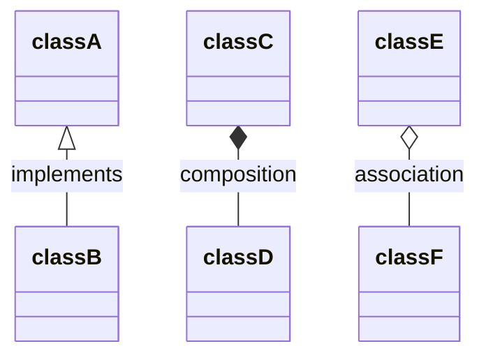

# 样例

## 简介
这里写本教程的内容，之后出推送的时候可以直接把它复制到推送里。

## 文件清单
一般来说，一个C++教程单元中有以下三个子文件夹：
- <code>docs/</code>：用来存放<code>.md</code>教程文件
- <code>imgs/</code>：用来存放<code>docs/</code>中教程所需图片（注意路径）
- <code>codes/</code>：用来存放能运行的代码示例
  

各位在写这一块的时候，只要说明下各文件夹下有什么文件、有什么作用就行。

## 参考资料
咱们C++教程的主要参考来源于以下讲义、书籍与网站：
- 清华大学计算机系姚海龙老师程序设计基础课件
- 《C++ Primer》（第五版）
- [cplusplus reference](https://www.cplusplus.com/reference/)
- [learn Cpp](https://www.learncpp.com/)
- [Microsoft C++ docs](https://docs.microsoft.com/en-us/cpp/cpp/?view=msvc-170)
- [GeeksforGeeks C++ tutorials](https://www.geeksforgeeks.org/c-plus-plus/)

各位在写这部分的时候把自己参考的资料列出来就行。

---

下面是一些你们写<code>README.md</code>的时候不必出现的东西：

## 有关类图的绘制

第六至十讲可能要手画一些简单的UML类图，有关C++类间关系及类图的参考资料如下：
- [UML Class Diagram Explained With C++ samples](https://cppcodetips.wordpress.com/2013/12/23/uml-class-diagram-explained-with-c-samples/)
- [learn Cpp](https://www.learncpp.com/)第16章
- [ C++ OOD and OOP - Class Diagram in UML](https://www.youtube.com/watch?v=thbxWbneJ6o)

关于如何绘制类图，这里有两个方案：

### 方案一、PlantUML
这里推荐[PlantUML](http://www.plantuml.com/plantuml/uml/SyfFKj2rKt3CoKnELR1Io4ZDoSa70000)。有关如何使用PlantUML画UML类图的参考资料如下：
- [PlantUML类图介绍](https://plantuml.com/zh/class-diagram)

生成UML类图后，只需在<code>.md</code>文件中附上图片链接，并在链接前加上<code>//https:</code>，即可显示。简单示例如下：
<div align="center">    

</div>

源代码如下：
```html
<div align="center">    

</div>
```
- 优点：不必自己截图，且比较好看
- 缺点：如果使用网站，类图加载速度慢，而且需要不断复制粘贴代码

### 方案二、
mermaid
<code>Typora</code>中有支持，可以直接渲染。但是很遗憾，GitHub中不支持。因此，一种比较快的解决方法是直接截图（统一采用默认主题），截图后把图片存在<code>imgs/</code>文件夹下。

<code>mermaid</code>绘制类图教程如下：
- [csdn中的Mermaid类图入门教程](https://blog.csdn.net/u012787240/article/details/112847071)
- [mermaid类图官方教程](https://mermaid-js.github.io/mermaid/#/classDiagram)

取得的效果如下图：
<div align="center">    

</div>

源代码如下图（若在<code>Typora</code>中显示，应当能够渲染出来，但在GitHub上还是代码块）：


- 优点：所见即所得，能在本地快速编辑
- 缺点：比较朴素，并且修改的话，得重新截图

## 有关<code>.md</code>文件中图片显示的问题

为了使得图片能够在非本地（如GitHub）能正常显示，你可能需要手动写下图片路径：

例如现在我处于<code>C++/样例/README.md</code>，想要去显示位于<code>MATLAB/快速入门/test_image/</code>中的<code>img1.jpg</code>，一个恰当的做法如下：
<div align="center">    

</div>

源代码如下：
```html
<div align="center">    

</div>
```

亦即，你需要把绝对路径改成相对路径。


