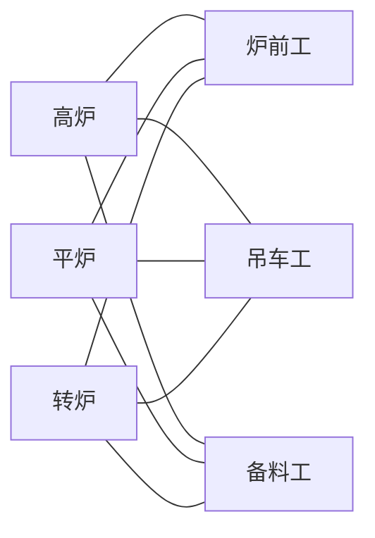
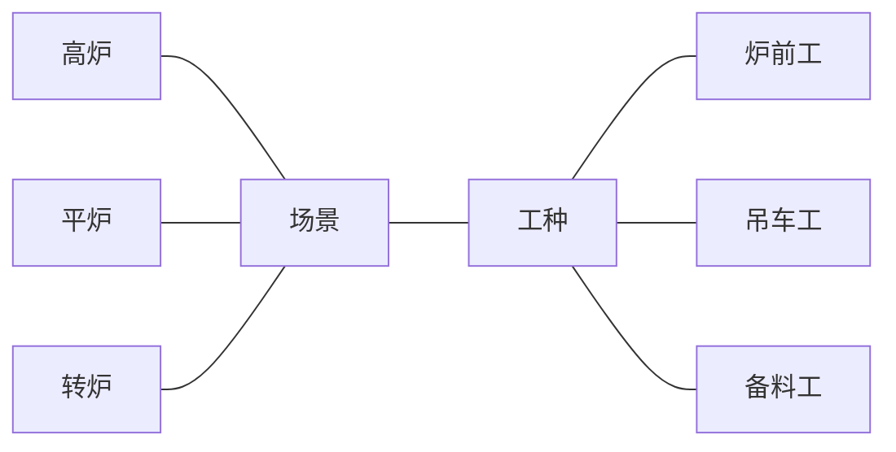

# 第九讲：桥接模式简介

在这部分的教程中，我们将向大家介绍一种经典的OOP设计模式——桥接模式。

## 桥接模式基本原理

桥接模式是一种很好地体现了OOP设计中一大基本原则“针对接口编程，而非针对实现编程”的设计模式。它涉及到一个作为桥接的接口，使得实现类的功能独立于接口类，这样可以把抽象化和实现化解耦，使得二者可以独立变化。

上述文段也许是抽象的，但下面我们可以通过一个实例来认识桥接模式的本质。

## 桥接模式实例

想象一个情景：钢铁公司生产一线有炉前工、吊车工、备料工等工种，有高炉、平炉、转炉等工作场景，现需要设计一个程序，让程序能够指导特定场景中的特定工种工作。

### 无模式法

接到这个问题，思维难度最低的思路也许是直接勤劳地构建各场景与各工种之间的联系，形成如下的网络结构：



通过图片我们能够直接发现这种做法的局限性：我们需要构建太多从场景到工种的联系，极大增加了维护成本（这种结构复杂到连比较智能的mermaid语法在构建对应的结构图时都很难把它画得好看一些）。

### 桥接模式法

面对“无模式法”的困难，我们能否运用“桥接模式法”呢？

仔细观察不难发现，平炉、高炉和转炉是以“场景”的面貌出现在各工种之前的，而炉前工、吊车工、备料工又是以“工种”的面貌出现在各场景之前的。按桥接模式的思想，我们可以独立地构建“场景”和“工种”两个接口类，把三个场景和三个工种之间的联系全部统一到这两个接口类之下，各实现类只需和对应的接口类建立联系即可。按这样的思路，我们可以画出另一种程序实现结构：



同“无模式法”的结构图做对比，我们能够很明显地看出采用了桥接模式的程序结构有很大简化。这种结构下抽象化和实现化实现了解耦，某一实现类变化时只需修改与对应的接口类之间的联系，而无需与其他实现类发生纠缠，降低了程序的维护成本。

### 桥接模式法代码示例

在下面的示例中我们能够具体体会借助抽象基类、虚函数和指向基类的指针（或引用）实现桥接模式的方法。

```C++
#ifndef __BRIDGE_PATTERN_H__
#define __BRIDGE_PATTERN_H__
#include <iostream>
#include <string.h>
#include <mutex>
using namespace std;

// 实现类接口:工种
class Job
{
public:
	Job(){}
	virtual ~Job(){}
	virtual void begin() = 0;
private:
};

// 具体实现类:炉前工
class luqian:public Job
{
public:
	luqian(){}
	void begin(){
		printf("炉前工工作开始\n");
	}
};

// 具体实现类:吊车工
class diaoche:public Job
{
public:
	diaoche(){}
	void begin(){
		printf("吊车工工作开始\n");
	}
};

// 具体实现类:备料工
class beiliao:public Job
{
public:
	beiliao(){}
	void begin(){
		printf("备料工工作开始\n");
	}
};

//抽象类：场景
class Place
{
public:
	Place(){}
	virtual ~Place(){}
	virtual void setup(Job *job) = 0;
	virtual void begin() = 0;
private:
	Job *job;
};

// 扩充抽象类：高炉
class gaolu:public Place
{
public:
	gaolu(){}
	void setup(Job *ijob){
		this->job = ijob;
	}
	void begin(){
		this->job->begin();
	}
private:
	Job *job;
};

// 扩充抽象类：平炉
class pinglu:public Place
{
public:
	pinglu(){}
	void setup(Job *ijob){
		this->job = ijob;
	}
	void begin(){
		this->job->begin();
	}
private:
	Job *job;
};

// 扩充抽象类：转炉
class zhuanlu:public Place
{
public:
	zhuanlu(){}
	void setup(Job *ijob){
		this->job = ijob;
	}
	void begin(){
		this->job->begin();
	}
private:
	Job *job;
};


#endif //__BRIDGE_PATTERN_H__
```

```C++
#include <iostream>
#include "BridgePattern.h"

int main()
{
	Place *place;
    Job *job;
    
	//在高炉前启动指导炉前工工作的程序
	place = new gaolu();
	job = new luqian();
	place->setup(job);
    place->begin();

	//改变，在平炉前启动指导吊车工工作的程序
    delete place;
	delete job;
    place = new pinglu();
	job = new diaoche();
	place->setup(job);
    place->begin();

	delete place;
	delete job;
	return 0;
}
```

输出为：

```
luqian begin
diaoche begin
```

