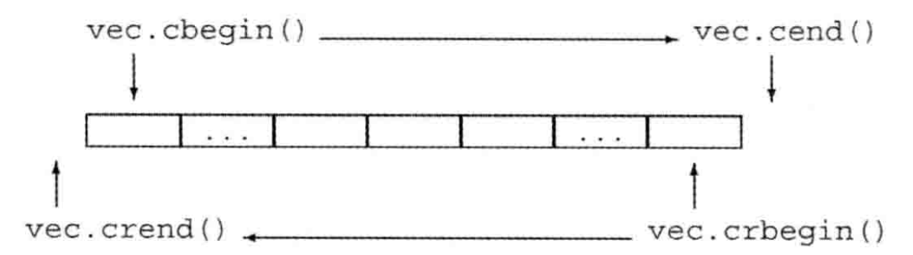

#第九讲：迭代器模式简介

​		通过上一讲的内容，相信大家已经简要了解了设计模式的原则；在本讲中，我们将学习一个具体的设计模式——**迭代器模式**，并了解迭代器模型的一个实现——**STL中的迭代器**。

## 迭代器模式

​		**迭代器模式**是一种特殊的设计模式，它允许人们**遍历（或迭代）**数据结构。其实迭代（遍历）的思想我们一直在使用，例如下面这个遍历数组中元素并打印的例子：

```c++
int a[5] = { 1,2,3,4,5 };
for (int i = 0; i < 5; i++)
	cout << a[i] << endl;
```

​		对于每一种数据结构，无论是像数组这样的**线性数据结构**还是像二叉树这样的**非线性数据结构**，都有具体的方法实现对数据结构中元素的遍历。但是如果对于每种数据结构都采用不同的方法进行遍历，就会导致最终的算法实现与数据结构之间有很强的**关联性**，这并不是我们所期望的。为了将数据结构与算法进行**解耦**，迭代器模式因运而生。

​		简单来讲，我们可以将迭代器理解为**可以对任意数据结构的元素进行迭代的工具**，正是由于它的通用性，使得算法的呈现形式与具体的数据结构无关，进而实现了算法与数据结构的**解耦**。迭代器有许多种类，如可以顺序访问数据的**前向迭代器**、可以逆序访问数据的**反向迭代器**、可以随机访问数据的**随机迭代器**……

​		总之，迭代器**抽象了接口**，使我们的数据结构在算法中更加灵活。使用迭代器可以使算法与数据结构解耦，因而更符合程序设计的规范。

## STL中的迭代器

​		在**C++的标准模板库（STL）**中实现了迭代器，所有的标准库容器都支持迭代器。除此之外，`string`（不属于容器类型）也支持迭代器。

> **容器**是STL中的一个重要的概念，在这里可以简单理解为**可以存储数据元素的数据结构的统称**。

​		迭代器提供了对对象的**间接访问**，使用迭代器可以访问容器中的某个元素，迭代器也能从一个元素移动到另一个元素。迭代器有**有效**和**无效**之分：**有效**的迭代器或者指向某个元素，或者指向容器中尾元素的下一位置；其他所有情况都属于**无效**。

### 迭代器范围

​		一个**迭代器范围**由一对迭代器表示，两个迭代器分别指向同一个容器中的元素或者是尾元素之后的位置。这两个迭代器通常被称为`begin`和`end`，它们标记了容器中元素的一个范围。

​		这种元素范围被称为**左闭合区间**，其数学表述为[begin , end)。迭代器`begin`和`end`必须指向相同的容器，`end`可以与`begin`指向相同的位置，但不能指向`begin`之前的位置。其中`end`通常被称为**尾后迭代器**。

### 迭代器支持的操作

1. `*iter`：返回迭代器`iter`所指元素的引用
2. `iter->mem`：解引用`iter`并获取该元素的名为`mem`的成员，等价于`(*iter).mem`
3. `++iter`：令`iter`指示容器中的下一个元素
4. `--iter`: 令`iter`指示容器中的上一个元素
5. `iter1 == iter2`/`iter1 != iter2`：判断两个迭代器是否相等（不相等），如果两个迭代器指示的是同一个元素或者它们是同一个容器的尾后迭代器，则相等；反之，不相等

### 迭代器支持的算术运算

​		下面给出迭代器支持的算术运算，注意并非所有容器的迭代器都支持这些运算。通常这些运算只能应用于`string`、`vector`、`deque`和`array`的迭代器。

1. `iter + n`：

   ​		迭代器加上一个整数值仍得一个迭代器，迭代器指示的新位置与原来相比向前移动了若干个元素。结果迭代器或者指示容器内的一个元素，或者指示容器尾元素的下一位置。

2. `iter - n`：

   ​		迭代器减去一个整数值仍得一个迭代器，迭代器指示的新位置与原来相比向后移动了若干个元素。结果迭代器或者指示容器内的一个元素，或者指示容器尾元素的下一位置。

3. `iter1 += n`：

   ​		迭代器加法的复合赋值语句，将`iter1`加`n`的结果赋给`iter1`

4. `iter1 -= n`：

   ​		迭代器减法的复合赋值语句，将`iter1`减`n`的结果赋给`iter1`

5. `iter1 - iter2`：

   ​		两个迭代器相间的结果是他们之间的距离，也就是说，将运算符右侧的迭代器向前移动差值个元素后将得到左侧的迭代器。参与运算的两个迭代器必须指向的是同一个容器中的元素或者尾元素的下一位置。

6. `>`、`>=`、`<`、`<=`：

   ​		迭代器的关系运算符，如果某迭代器指向的容器位置在另一个迭代器所指位置之前，则说前者小于后者。参与运算的两个迭代器必须指向的是同一个容器中的元素或者尾元素的下一位置。

### 常迭代器

```c++
vector<int>::iterator it1; //it1能读写vector<int>的元素
string::iterator it2; //it2能读写string对象中的字符

vector<int>::const_iterator it3; //it3只能读元素，不能写元素
string::const_iterator it4; //it4能读字符，不能写字符
```

​		如上面的例子所示，**常迭代器（const_iterator）**和常量指针类似，能读取但不能修改它所指的元素值。而普通的迭代器（iterator）的对象可读可写。如果`vector`对象或`string`对象是一个常量，只能使用const_iterator；如果`vector`对象或`string`对象不是常量，那么既能使用iterator也能使用const_iterator。

### 反向迭代器

​		除了为每个容器定义迭代器之外，标准库在头文件`iterator`中还定义了额外几种迭代器，分别是**插入迭代器（insert  iterator）**、**流迭代器（stream  iterator）**、**反向迭代器（reverse  iterator）**、**移动迭代器（move  iterator）**。下面将详细介绍反向迭代器。

​		**反向迭代器**就是在容器中从尾元素向首元素反向移动的迭代器。对于反向迭代器，递增（以及递减）操作的含义会颠倒过来。递增一个反向迭代器`++it`会移动到前一个元素；递减一个迭代器`--it`会移动到下一个元素。

​		除了`forward_list`之外，其他容器都支持反向迭代器。我们可以通过调用`rbegin`、`rend`、`crbegin`、`crend`成员函数来获得反向迭代器。下图以一个名为vec的`vector`为例来说明这4种迭代器的位置分布：

<div align="center">    

</div>

​		需要注意的是，我们只能从即支持`++`也支持`--`的迭代器来定义反向迭代器。毕竟反向迭代器的目的是在序列中反向移动。除了`forward_list`之外，标准容器上的其他迭代器都即支持递增运算又支持递减运算。但是，**流迭代器不支持递减运算**，因为不可能在一个流中反向移动。因此，不可能从一个`forward_list`或一个流迭代器创建反向迭代器。


------

​		为了使大家对迭代器模式能够有更深刻的理解，我编写了一份实例代码放在`codes/`文件夹内，该例子实现了**使用迭代器和反向迭代器对vector中的元素进行遍历**；大家可以自行阅读和运行尝试。祝大家学习愉快！

